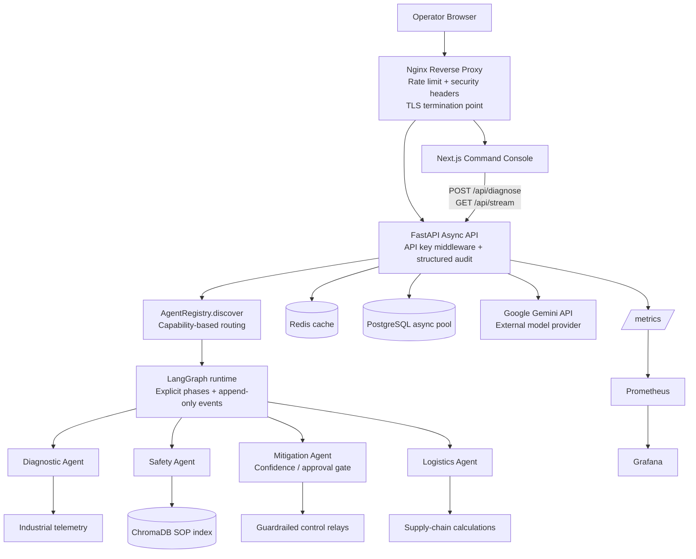

# Unified Enterprise Topology

## Runtime Responsibilities

1. Nginx is the controlled ingress and rate-limits `/api/*`; HTTPS certificates can be mounted at this boundary.
2. Next.js provides the operator console and consumes SSE updates while a diagnosis is running.
3. FastAPI handlers are asynchronous. Blocking LangGraph and SDK calls run off the event loop, and external calls use bounded fallback attempts.
4. `AgentRegistry.discover()` selects agents by capability and explicit workflow phase. State events are copied and appended for auditability.
5. Redis caches repeated episodic searches; PostgreSQL is available through a bounded async connection pool.
6. Prometheus scrapes `/metrics`; Grafana is available on port `3001` in the compose profile.

## Security and Operations

- `API_KEY` protects non-public API routes. Use `X-API-Key` or `Authorization: Bearer ...`.
- Secrets belong in `.env`, based on [.env.example](.env.example); do not commit live values.
- `scripts/rotate_secrets.ps1` rotates API, JWT, and database credentials in a local env file.
- Every request receives an `X-Request-ID`; authentication failures, rate limiting, workflow failures, and request completion are structured JSON logs.
- Docker services use `unless-stopped`, health checks where applicable, and CPU/memory limits.
- Local development uses `nginx/nginx.conf` over HTTP. The production overlay uses `nginx/nginx.tls.conf`, redirects HTTP to HTTPS, and mounts certificate material supplied through `TLS_CERT_DIR`.
